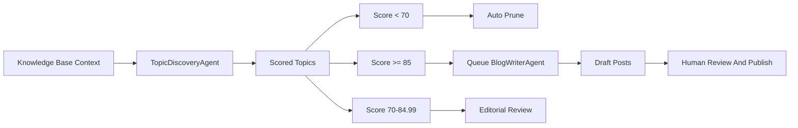

# AI Content Engine

## Purpose

This document explains the current AI content engine in `widewebblog/service`.

The service uses AI to accelerate editorial work, not to replace editorial approval.

## Current Rules

- AI never publishes posts directly.
- topic discovery creates scored topics.
- topics below `70` are pruned automatically.
- topics from `70` through `84.99` remain in Topic Queue for editorial review.
- topics at `85` or higher queue draft generation automatically.
- generated posts remain drafts until an admin reviews and publishes them.
- image generation is not part of the active workflow.

## Current Flow

## Main Building Blocks

### Knowledge Base Context

Knowledge Base entries ground topic discovery and blog generation. `KnowledgeContextService` formats prompt-safe context with size limits.

### Agents

The main editorial flow includes:

- `TopicDiscoveryAgent`
- `BlogWriterAgent`

The codebase also contains narrower helper AI passes for metadata and title/excerpt suggestions, but they are not the core discovery-to-draft flow.

### Internal AI Tools

The active internal tool set supports:

- duplicate topic checks
- saving suggested topics
- saving post drafts
- searching existing posts
- finding internal links

### Workflow Orchestration

`AiWorkflowOrchestrator` coordinates:

- topic discovery
- blog draft generation
- helper post suggestion flows

The main orchestrated editorial pipeline delegates to:

- `TopicDiscoveryWorkflow`
- `DraftGenerationWorkflow`

## Admin Surfaces

### Topic Queue

Topic Queue is backed by `content_topics` and supports:

- listing topics
- creating manual topics
- inspecting scored topics
- marking topics used when a draft has already been consumed
- understanding whether automation pruned or queued a topic

### AI Jobs

AI jobs are backed by `ai_jobs` and support:

- listing jobs
- reading a job
- queueing topic discovery
- retrying failed jobs

### Prompt Management

Prompt templates are backed by `ai_prompt_templates` and `ai_prompt_template_versions`.

The editable standard families are:

- `topic_standard`
- `blog_standard`

## Queue And Execution Model

Long-running AI work uses the `ai` queue.

Expected model:

1. Admin, command, or scheduler triggers a workflow.
2. The workflow creates an `ai_jobs` record.
3. The queue job is dispatched.
4. The agent runs through provider-agnostic AI client abstractions.
5. Generation steps, usage, and errors are recorded.
6. Domain records are updated only when business rules allow it.

## Retry And Safety Expectations

- retries are explicit and tracked
- failed jobs can be retried from the AI jobs flow
- retry paths must not create duplicate topics or posts
- existing domain state should be reused where possible

## Provider And Prompt Boundaries

- provider details stay behind internal AI client abstractions
- main-flow prompts are database-backed and versioned
- the main-flow prompt source of truth is prompt templates, not `site_settings`

## Out Of Scope In This Phase

- autonomous publishing
- content briefs
- template-driven draft creation
- AI-generated images
- direct frontend AI interaction
