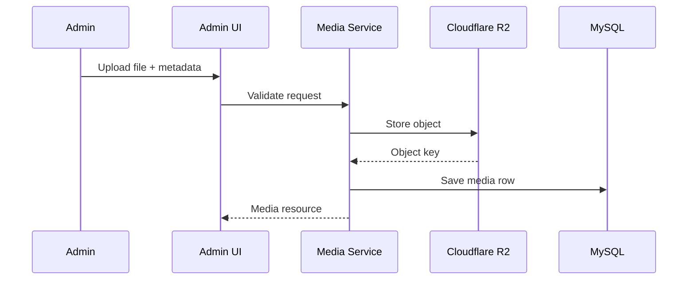

# Media Service Specification: Wide Web Blog

## Document Purpose

This document defines the media subsystem for Wide Web Blog. The media service manages upload, storage, metadata, retrieval, attribution, and usage tracking for editorial assets stored in Cloudflare R2.

## Storage Model

- storage backend: Cloudflare R2
- disk type: S3-compatible
- application record of truth: `media` table
- binary record of truth: object in R2

## Source Types

- `uploaded`
- `ai_generated`
- `stock`

## Media Service Responsibilities

- upload files
- persist media metadata
- store image metadata
- manage alt text and captions
- track source and attribution
- determine public URLs
- prevent unsafe deletion
- support future AI-generated and stock image workflows

## Upload Flow

## Single Upload Flow

1. Admin selects one file.
2. Admin optionally enters alt text, caption, source type, source URL, attribution.
3. System validates file size, mime type, and metadata.
4. File is uploaded to R2.
5. Media row is created with dimensions and metadata if applicable.
6. Media asset becomes selectable in the media library.

## Multiple Upload Flow

1. Admin selects multiple files.
2. System uploads files sequentially or in controlled batches.
3. Each file creates a separate media row.
4. Post-upload metadata editing remains available per asset.

## Folder / Collection Strategy

Recommended object key pattern:

- `media/{year}/{month}/{ulid}-{sanitized-filename}.{ext}`

Examples:

- `media/2026/06/01J...-ai-agent-memory-diagram.webp`
- `media/2026/06/01J...-laravel-queue-architecture.png`

Optional future collections:

- `media/generated/{year}/{month}/...`
- `media/stock/{provider}/{year}/{month}/...`

Recommendation:

- keep collection semantics in database metadata, not only in path conventions

## File Metadata

Every media item should store:

- `ulid`
- `storage_provider`
- `bucket_name`
- `object_key`
- `original_filename`
- `mime_type`
- `extension`
- `file_size_bytes`
- `checksum_sha256`
- `status`
- `source_type`
- `source_url`
- `attribution_text`

## Image Metadata

For images, also store:

- `width`
- `height`
- `alt_text`
- `caption`
- optional derivative metadata later

## Alt Text Rules

- alt text should be editable separately from filename
- alt text is required for images used in published content
- decorative images should be rare in a technical publication
- alt text should describe the meaning of the image, not only the file name

## Caption Rules

- captions are optional
- captions should be used when they add explanatory value
- captions should not duplicate alt text exactly

## Source URL And Attribution

### Uploaded

- `source_url`: optional
- `attribution_text`: optional

### AI Generated

- `source_url`: usually null
- `attribution_text`: optional internal note
- should store related AI job reference where available

### Stock

- `source_url`: required when provider requires source tracking
- `attribution_text`: required when license or provider requires it
- provider name should also be preserved in metadata

## Delete Rules

Media deletion should be conservative.

### Allow Delete When

- asset is not referenced by posts, SEO metadata, or knowledge entries
- asset is in failed or orphaned state

### Block Delete When

- asset is used as featured media
- asset is referenced by rendered article content or metadata-controlled media usage
- asset is used as Open Graph image

### Delete Flow

1. Check usage references.
2. If safe, delete object from R2.
3. Soft-delete or archive media row.
4. Log deletion event if needed.

## Usage Tracking

Track at least:

- featured post usage
- article content usage where tracked
- SEO image usage
- knowledge base usage

Recommendation:

- store computed usage count and expose actual references in admin later

## Public URL Strategy

Preferred strategy:

- generate public CDN-backed URL from storage config
- avoid persisting full public URLs as the source of truth
- persist object identity and derive URL

### URL Rules

- stable URL per asset
- no admin-only paths in asset URLs
- support future CDN migration by deriving URL in code

## Image Optimization Strategy

### MVP

- accept sensible image formats
- preserve original upload
- enforce file size limits
- encourage WebP where practical

### Near Future

- generate derivatives asynchronously if needed
- support responsive image sizes
- support Open Graph-specific output

Recommendation:

- do not overbuild a derivative system before actual traffic and editorial needs justify it

## Media Library Search

Search should support:

- filename
- alt text
- caption
- source type
- mime type

Filters should support:

- source type
- image vs non-image
- used vs unused
- date uploaded

## Future AI Image Support

Future AI image workflow should:

- generate asset from prompt
- store prompt and job linkage in AI job metadata
- save resulting asset through the same media service
- set `source_type = ai_generated`
- require human review before being used in published posts

## Future Stock Image Support

Stock image workflow should:

- search provider API
- import selected asset into local media library
- preserve source URL and attribution
- avoid hotlinking where policy or performance makes local copy preferable

## Validation Rules

- enforce allowed mime types
- enforce max file size
- require alt text before publish when asset is used on published content
- require source metadata for stock assets
- reject unsupported image metadata payloads

## Events And Jobs

Potential events:

- `MediaUploaded`
- `MediaDeleted`
- `MediaMetadataUpdated`

Potential jobs:

- image metadata extraction
- derivative generation
- broken reference scan

## Summary

The media service should be a storage-aware, metadata-rich subsystem that centralizes asset handling for editorial uploads, future AI-generated images, and stock imports. It should preserve clean Cloudflare R2 integration, strong metadata quality, safe deletion rules, and publish-ready accessibility standards.
