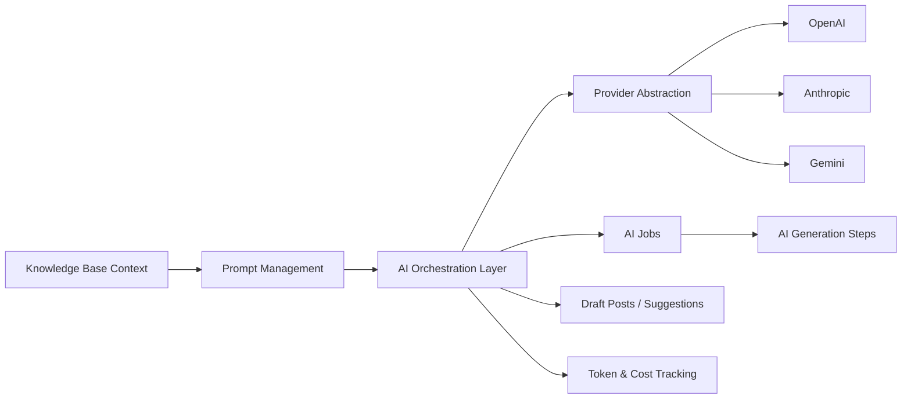

# AI Content Engine Specification: Wide Web Blog

## Document Purpose

This document defines the AI content engine for Wide Web Blog. The engine supports AI-assisted publishing while preserving human editorial control.

## Non-Negotiable Rule

AI must never directly publish content.

AI may only create:

- topic suggestions
- content briefs
- draft posts
- SEO metadata suggestions
- FAQs
- tags
- image ideas, placement notes, and alt text suggestions

All generated output must remain draft or review-only until explicitly approved by an admin.

## System Goals

- accelerate editorial ideation and drafting
- preserve original human judgment
- reduce repetitive publishing work
- support multiple providers through a stable abstraction
- keep AI operations traceable, retryable, and cost-aware

## High-Level Architecture

## AI Provider Abstraction

The provider layer should expose internal contracts rather than vendor-specific method calls.

### Required Capabilities

- text generation
- structured generation or normalized response extraction
- token and usage reporting

### Contract Goals

- swap providers without changing domain services
- isolate provider-specific payloads
- normalize result structure

## Prompt Management

Prompt management should be a first-class subsystem, not hidden in code constants.

### Prompt Requirements

- prompt templates by workflow type
- versioning
- categories
- optional provider-specific overrides
- editable admin management later

### Prompt Categories

- topic discovery
- content brief
- blog writer
- editor
- seo optimizer
- publishing

## Topic Discovery Agent

### Purpose

Generate topic suggestions aligned with content pillars and category focus.

### Inputs

- content pillars
- existing topics
- published content map
- knowledge base context

### Outputs

- suggested topics
- optional category mapping
- optional discovery score

### Rules

- write to topic queue only
- no direct draft creation without approval step

## Content Brief Agent

### Purpose

Turn approved topics into structured article plans before draft generation.

### Inputs

- approved topic
- knowledge base context
- pillar and cluster guidance
- existing internal content context

### Outputs

- recommended article angle
- section structure
- internal link suggestions
- SEO intent hints
- image ideas and alt text suggestions

### Rules

- brief should be inspectable before draft generation
- brief output should be structured, not raw HTML
- only approved topics can generate briefs

## Blog Writer Agent

### Purpose

Generate draft post content from approved content briefs.

### Inputs

- approved content brief
- prompt template
- knowledge base context

### Outputs

- markdown body
- draft post blocks
- optional excerpt
- editable SEO draft fields

### Rules

- draft only
- no auto-publish
- raw generated HTML is not the source of truth
- output should map into structured content blocks
- only approved briefs can generate drafts
- image handling stays manual in MVP

## Scheduled Jobs

Scheduler should support:

- periodic topic discovery
- queued draft generation for approved items
- refresh recommendation analysis later

### Scheduling Rules

- all scheduled AI operations must create tracked AI job records
- scheduled operations must respect feature flags and provider availability

## Queue Flow

Recommended queue separation:

- `ai` for AI text jobs
- `media` for future image or asset jobs
- `default` for supporting orchestration

### Flow

1. User or scheduler triggers workflow.
2. AI job record is created.
3. Job is pushed to queue.
4. Provider abstraction executes call.
5. AI generation step is recorded.
6. Normalized output is stored.
7. Draft or suggestion records are updated.
8. Cost and usage are stored.

## AI Job Tracking

Each AI job should track:

- job type
- target type and ID
- provider
- model
- prompt template/version
- status
- attempts
- started/completed timestamps
- input snapshot
- output snapshot
- error message if failed

Each AI generation step should track:

- parent job
- agent name
- status
- input snapshot
- output snapshot
- usage metadata
- error message if failed

Statuses:

- `pending`
- `queued`
- `processing`
- `completed`
- `failed`
- `cancelled`
- `reviewed`

## Token / Cost Tracking

The engine should store:

- input tokens
- output tokens
- cached tokens when provided
- estimated cost
- billed cost when available
- provider
- model

Track cost per call and per job so multi-step workflows remain attributable.

## Error Handling

The system should handle:

- provider timeouts
- malformed provider responses
- rate limits
- missing prompt configuration
- validation failures when mapping generated output

### Error Rules

- failures must not corrupt post state
- failed jobs must retain enough context for inspection
- user-facing errors should be readable and actionable

## Retry Behavior

- retries should be explicit and tracked
- use capped retries for provider failures
- do not duplicate draft creation on retry
- idempotency should be enforced at job orchestration level where practical

## Human Review Workflow

1. Topic suggestion is created.
2. Admin approves topic.
3. Content brief is generated and reviewed.
4. Draft content is generated.
5. Admin edits and validates content.
6. SEO suggestions, tags, and image notes are reviewed.
7. Only then may the post move through normal publish workflow.

## Provider Notes

### OpenAI

- first likely provider for draft generation and structured assistance

### Anthropic

- strong candidate for reasoning-heavy generation or editorial synthesis

### Gemini

- useful for provider diversity and future experimentation

The engine should keep these interchangeable at orchestration level.

## Suggested Admin Touchpoints

- topic queue
- content briefs
- AI jobs screen
- prompt management
- post editor suggestion panels
- SEO suggestion panels

## Security And Governance

- never expose provider secrets in admin UI
- log enough to debug, not enough to create unnecessary data risk
- treat AI output as untrusted until reviewed
- use feature flags for experimental AI workflows

## Summary

The AI content engine should function as an editorial acceleration layer, not an autonomous publisher. Its job is to move work safely through topic suggestions, content briefs, draft posts, metadata suggestions, and image notes while keeping all final editorial and publishing decisions in human hands.
