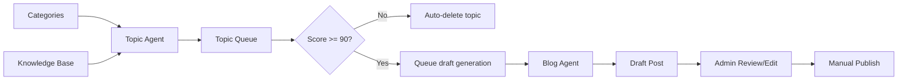
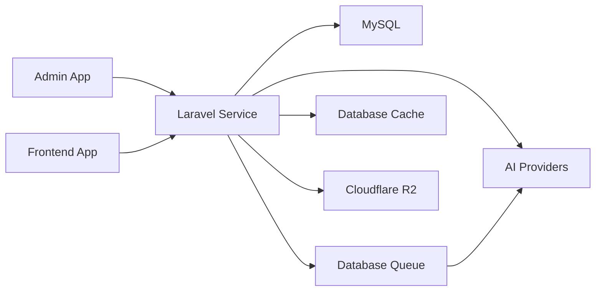

# Architecture: Wide Web Blog Service

## Purpose

This document describes the current target architecture for the `widewebblog/service` application after the editorial workflow reset.

The system is now optimized for a simpler backend:

- topic discovery from categories plus knowledge base support
- topic scoring with automatic routing
- one article draft per qualified topic
- human review in admin before publish
- article-first post storage for a Quill-based editor

## Current Platform Shape

The service is a Laravel 13 backend responsible for:

- admin and frontend API contracts
- content persistence and workflow rules
- AI orchestration
- media management
- SEO metadata
- background jobs

Sibling applications exist separately:

- `../admin`
- `../fe`

They are clients of this service, not part of the service runtime.

## Core Infrastructure

- Laravel 13
- MySQL as the system of record
- Laravel queue with database-backed defaults
- Laravel cache with database-backed defaults
- Cloudflare R2 for media storage
- provider-agnostic AI client abstractions

Redis is not part of the baseline architecture.

## Product Flow

The canonical editorial flow is:

1. Topic Queue stores candidate topics.
2. Topic Agent generates and scores topics from categories plus knowledge base context.
3. Topics with score below `90` are automatically deleted by worker cleanup.
4. Topics with score above `90` automatically queue article draft generation.
5. Blog Agent generates one full article draft using the standard blog prompt.
6. Admin reviews and edits the draft in a Quill-based article editor.
7. Publish remains manual.

## Content Model Direction

Posts are article-first. The service should treat the article body as the canonical editorial surface rather than a collection of layout blocks.

Posts are expected to support:

- `title`
- `short_description`
- `description`
- `full_article_html` and/or `full_article_markdown`
- `featured_media_id`
- `faq` as structured JSON
- SEO metadata
- provenance and workflow metadata

The service no longer models:

- content briefs
- reusable post templates
- template blocks
- post content blocks
- template preview or seeding workflows

## Prompt Management

The main editorial flow uses a simplified prompt model:

- one standard topic prompt
- one standard blog prompt

Prompt templates can remain versioned in the database, but only as the source of truth for those standard flows. Site settings should not duplicate active prompt instruction content.

## Application Boundaries

The service owns:

- category and knowledge-base driven topic generation
- topic scoring and auto-routing
- post draft creation
- media persistence and lookup
- AI job tracking
- SEO-ready publish data

The service should not own rich admin editor behavior directly. The admin app may use Quill, but the backend responsibility is stable article storage and clean API contracts.

## Runtime Architecture

## Service Design Pattern

The preferred backend pattern remains:

`Controller -> FormRequest -> DTO -> Service/Action -> Repository -> Model/Client -> API Resource`

Use this pattern by default unless a module already has a narrower established pattern.

Responsibilities:

- controllers coordinate request and response
- requests validate inputs
- DTOs carry normalized data
- services/actions own business workflow
- repositories own query and persistence logic
- resources format API output
- AI and storage integrations stay behind dedicated clients or services

## AI Workflow Boundary

AI completion does not imply editorial approval.

Operational automation may:

- discover topics
- score topics
- delete low-score topics
- queue article drafts
- persist generated draft content

But only admin review may decide whether a draft becomes published content.

## Media Boundary

Cloudflare R2 stores uploaded media and featured assets. The service stores metadata and relationships in MySQL.

AI may suggest:

- featured image ideas
- image placement guidance
- alt text suggestions

The current baseline does not require automated AI image generation.

## Design Constraints

- Keep the main flow topic-to-article, not topic-to-brief-to-article.
- Prefer one canonical article body over multiple block abstractions.
- Keep prompts simple and versioned.
- Keep publish safety explicit: AI writes drafts, humans publish.
- Treat the application as a fresh-start baseline; avoid preserving dead schema for backward compatibility.
