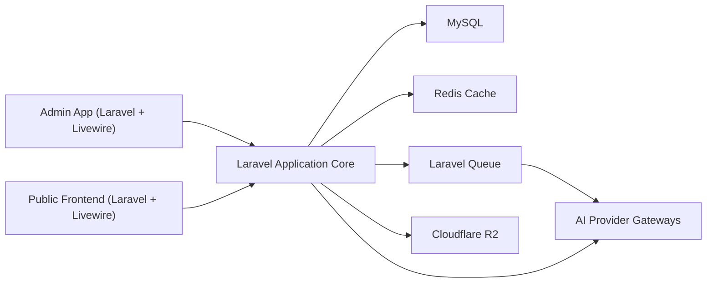
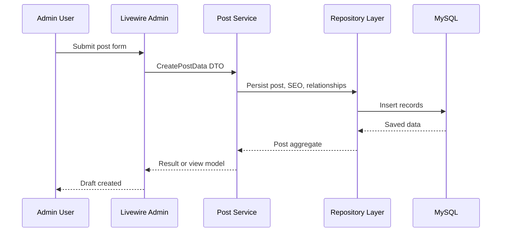
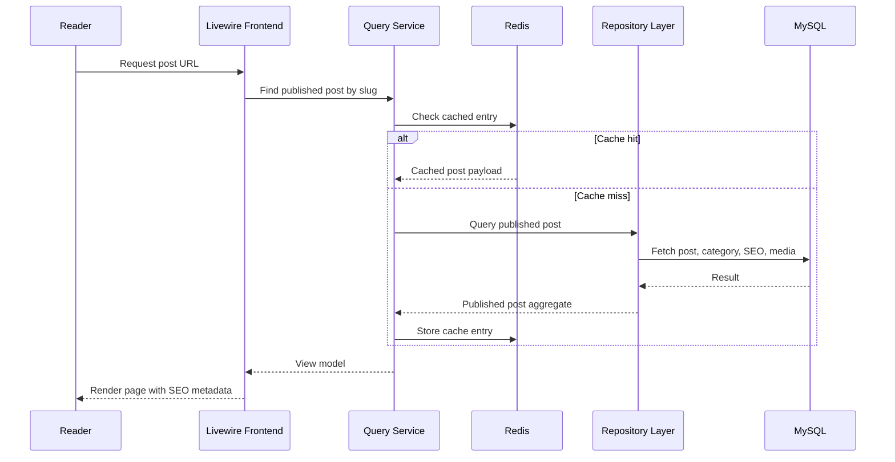
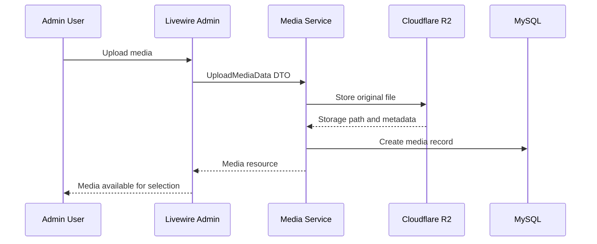
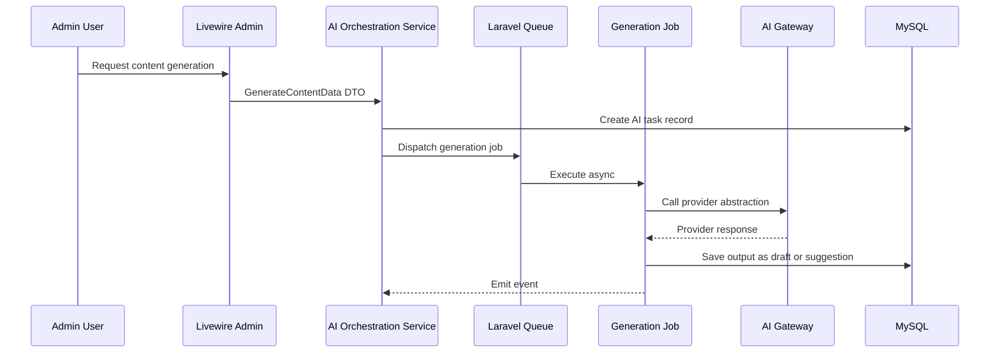
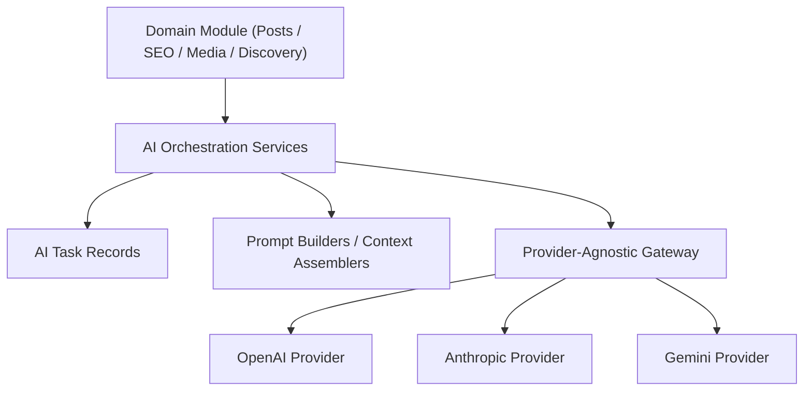
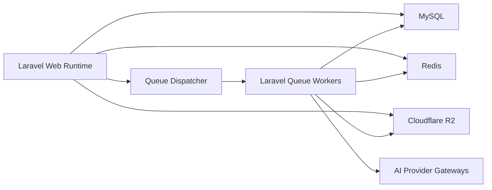

# Architecture: Wide Web Blog

## Document Purpose

This document defines the target technical architecture for Wide Web Blog. It is the reference point for how the platform should be structured during the MVP and how it should evolve to support future AI-assisted publishing capabilities without major rewrites.

This architecture is designed for:

- a Laravel 13 backend API and application core
- Laravel 13 + Livewire admin interfaces
- Laravel 13 + Livewire public frontend rendering
- MySQL for transactional data
- Redis for caching and queue infrastructure
- Laravel Queue for asynchronous workflows
- Cloudflare R2 for media storage

The system must support a focused Phase 1 publishing release while remaining extensible enough for future AI agents, multi-author workflows, and eventual SaaS expansion.

## Architecture Goals

- ship a stable MVP quickly
- preserve clean boundaries between content management, rendering, SEO, media, and AI workflows
- keep the content lifecycle explicit and safe
- isolate external integrations behind abstractions
- support asynchronous processing for expensive or slow operations
- avoid coupling the product to a single AI provider
- make future agents additive rather than invasive

## High-Level Architecture

Wide Web Blog should be built as a modular Laravel application with a layered service architecture.

At a high level:

- Livewire-powered admin and frontend surfaces interact with Laravel application services
- the application core owns validation, business rules, content workflows, and orchestration
- MySQL stores content, metadata, templates, and knowledge records
- Redis supports caching and queue execution
- Laravel Queue handles asynchronous jobs
- Cloudflare R2 stores media assets
- future AI providers are accessed through provider-agnostic gateways



## System Components

### 1. Admin Interface

The admin interface is responsible for:

- category management
- post management
- media selection and upload initiation
- template management
- knowledge base management
- SEO field management
- future AI-assisted editorial actions

The admin should remain orchestration-light. It calls into application services rather than embedding workflow logic in Livewire components.

### 2. Public Frontend

The public frontend is responsible for:

- rendering published posts
- rendering category archives and content listings
- exposing SEO metadata and structured data
- presenting media assets and related published content

The public frontend must consume only publish-safe data and must never expose drafts or internal editorial content.

### 3. Laravel Application Core

This is the operational center of the system. It owns:

- request handling
- input validation
- content lifecycle rules
- service orchestration
- persistence coordination
- event dispatching
- async job scheduling
- integration with storage, cache, and AI providers

### 4. MySQL

MySQL is the system of record for:

- posts
- categories
- templates
- knowledge base entries
- SEO metadata
- media records
- AI task records
- workflow state and audit-relevant metadata

### 5. Redis

Redis should be used for:

- application caching
- queue backend support
- transient locks where needed
- future rate limiting or concurrency protection for AI tasks

### 6. Laravel Queue

The queue layer should handle:

- media processing
- sitemap rebuilds
- AI content generation
- AI image generation
- SEO analysis or recommendation jobs
- future background enrichment and indexing tasks

### 7. Cloudflare R2

Cloudflare R2 stores:

- featured images
- uploaded editorial media
- future AI-generated images
- processed media variants if introduced later

### 8. AI Provider Gateways

Future AI capabilities should integrate through provider abstractions rather than direct application coupling.

This layer should support:

- OpenAI
- Anthropic
- Gemini
- future providers if needed

## Architectural Style

The default service pattern should be:

`Controller or Livewire Action -> Form Request or Validation Layer -> DTO -> Service -> Repository -> Model or External Gateway`

For output:

`Service Result -> Resource or View Model -> Livewire/View/API Response`

This pattern keeps each layer focused:

- controllers and Livewire actions coordinate input and output
- DTOs carry validated data
- services own business workflows
- repositories own query and persistence logic
- gateways isolate external systems

## Request Flows

## 1. Admin Post Creation Flow



### Flow Notes

- validation occurs before the service is invoked
- the service controls slug handling, publish rules, and related record writes
- the initial state should default to draft unless explicitly published through an allowed workflow

## 2. Public Post Read Flow



### Flow Notes

- only published records are eligible for public rendering
- SEO metadata and structured data should be assembled from publish-safe content
- caching should be invalidated when published content changes

## 3. Media Upload Flow



### Flow Notes

- media records should exist in MySQL even though binaries live in R2
- future async processing can be added after the initial upload completes

## 4. Future AI Generation Flow



### Flow Notes

- AI outputs must never bypass draft and review boundaries
- orchestration should target internal task records, not direct post publication
- provider-specific prompt handling belongs behind the AI integration layer

## Module Boundaries

The codebase should be organized around explicit business modules. Each module owns its own services, repositories, DTOs, jobs, events, and policies where appropriate.

### Core MVP Modules

- `Categories`
- `Posts`
- `Media`
- `Templates`
- `KnowledgeBase`
- `Seo`
- `FrontendPublishing`

### Supporting Platform Modules

- `Auth`
- `Users`
- `Shared`
- `Infrastructure`
- `Ai`

### Boundary Rules

- posts own editorial content state and publication rules
- categories own taxonomy structure
- media owns asset storage coordination and metadata
- templates own reusable editorial scaffolding
- knowledge base owns internal reference content
- SEO owns metadata rules, sitemap integration, and structured SEO logic
- AI owns orchestration, provider access, and task tracking, but not publication authority

The AI module should augment posts, SEO, images, and discovery workflows without taking ownership of those domains.

## Recommended Folder Structure

The application should prefer feature-oriented organization over a flat technical sprawl.

```text
app/
  Modules/
    Posts/
      Actions/
      DTOs/
      Events/
      Jobs/
      Models/
      Policies/
      Repositories/
      Resources/
      Services/
      Support/
    Categories/
    Media/
    Templates/
    KnowledgeBase/
    Seo/
    Ai/
    Shared/
      DTOs/
      Enums/
      Exceptions/
      Support/
  Http/
    Controllers/
    Requests/
  Livewire/
    Admin/
    Frontend/
  Infrastructure/
    Ai/
      Contracts/
      Gateways/
      Providers/
    Media/
    Cache/
    Search/
  Providers/
  Console/
  Policies/
  Exceptions/
database/
  migrations/
  factories/
  seeders/
resources/
  views/
routes/
  web.php
  api.php
```

### Folder Structure Guidance

- keep business rules near the module they belong to
- place provider-specific integrations under `Infrastructure`
- keep shared abstractions small and intentional
- avoid dumping all services or repositories into global directories without module context

## Service Layer Design

The service layer is the main orchestration layer of the system.

### Responsibilities

- enforce business rules
- coordinate repositories and gateways
- manage transactions
- dispatch events and jobs
- shape internal workflow results
- guard publish-state transitions

### Service Types

The architecture should support three service categories:

#### 1. Command Services

Used for state-changing operations.

Examples:

- `CreatePostService`
- `UpdatePostService`
- `PublishPostService`
- `UploadMediaService`
- `CreateTemplateService`

#### 2. Query Services

Used for read-focused composition or optimized read models.

Examples:

- `GetPublishedPostService`
- `ListPublishedPostsService`
- `GetAdminPostEditorStateService`

#### 3. Orchestration Services

Used for workflows spanning multiple subsystems.

Examples:

- `GenerateContentDraftService`
- `ProcessUploadedMediaService`
- `RebuildSitemapService`

### Service Example

```php
final class PublishPostService
{
    public function __construct(
        private PostRepository $posts,
        private SeoMetadataRepository $seoMetadata,
        private Dispatcher $events,
    ) {}

    public function handle(PublishPostData $data): Post
    {
        return DB::transaction(function () use ($data) {
            $post = $this->posts->findOrFail($data->postId);

            $post->publish(
                publishedAt: now(),
            );

            $this->posts->save($post);

            $this->events->dispatch(new PostPublished($post->id));

            return $post;
        });
    }
}
```

## Repository Layer Design

Repositories should encapsulate persistence and reusable query logic while leaving business policy decisions to services.

### Responsibilities

- load entities and related data
- encapsulate query filters and sorting
- provide publish-safe selectors
- support cacheable read queries
- centralize persistence operations where reuse is valuable

### Repository Rules

- repositories should not own business workflows
- repositories should not call external APIs
- repositories should not decide publish authorization
- repositories may return models, collections, paginated results, or purpose-built projections

### Repository Examples

- `PostRepository`
- `PublishedPostRepository`
- `CategoryRepository`
- `MediaRepository`
- `TemplateRepository`
- `KnowledgeEntryRepository`
- `SeoMetadataRepository`
- `AiTaskRepository`

### Example Repository Interface

```php
interface PublishedPostRepository
{
    public function findBySlug(string $slug): ?Post;

    public function paginateLatest(int $perPage = 15): LengthAwarePaginator;

    public function paginateByCategory(string $categorySlug, int $perPage = 15): LengthAwarePaginator;
}
```

## DTO Strategy

DTOs should be the standard mechanism for moving validated input into services and jobs.

### DTO Goals

- reduce array-shaped ambiguity
- make services explicit and testable
- support stable contracts across controllers, Livewire, jobs, and future agents

### DTO Types

#### 1. Input DTOs

Examples:

- `CreatePostData`
- `UpdatePostData`
- `UploadMediaData`
- `CreateTemplateData`
- `GenerateImageData`

#### 2. Filter DTOs

Examples:

- `ListPostsFilters`
- `SearchKnowledgeBaseFilters`

#### 3. Workflow DTOs

Examples:

- `GenerateContentRequestData`
- `RunSeoAnalysisData`
- `DiscoverTopicsData`

### DTO Rules

- prefer readonly DTOs where possible
- construct DTOs from validated input
- keep DTOs free of database and container dependencies
- use dedicated factories or `fromArray` constructors when helpful

### Example DTO

```php
final readonly class CreatePostData
{
    public function __construct(
        public string $title,
        public string $body,
        public ?int $categoryId,
        public ?string $seoTitle,
        public ?string $seoDescription,
        public bool $publishNow = false,
    ) {}
}
```

## Event And Job Strategy

Events and jobs should support decoupled workflows and asynchronous execution without hiding core business rules.

### Domain Events

Use events when something important happened in the domain and other components may react.

Examples:

- `PostCreated`
- `PostPublished`
- `PostUnpublished`
- `MediaUploaded`
- `TemplateApplied`
- `KnowledgeEntryUpdated`
- `AiTaskCompleted`

### Jobs

Use jobs for:

- slow work
- retryable work
- integration work
- bulk processing
- CPU or I/O heavy work

Examples:

- `ProcessMediaUploadJob`
- `GenerateAiDraftJob`
- `GenerateAiImageJob`
- `GenerateSeoRecommendationsJob`
- `RebuildSitemapJob`
- `WarmPublishedPostCacheJob`

### Event-Job Interaction

Preferred pattern:

- service commits the core state change
- domain event is emitted
- listeners may dispatch async jobs
- downstream jobs write non-authoritative enrichments or operational side effects

This keeps the authoritative publishing transaction simple while still enabling automation.

## Queue Architecture

Queues should be first-class architecture, not an afterthought.

### Queue Categories

- `default` for low-priority operational jobs
- `media` for uploads and transformations
- `seo` for sitemap and SEO processing
- `ai` for model-driven jobs
- `notifications` if messaging is introduced later

### Queue Principles

- AI tasks must be isolated from content CRUD responsiveness
- failed jobs must be retryable without corrupting publish state
- long-running jobs should write progress to task records
- queue workers should be horizontally scalable later

### Recommended Async Targets

- AI generation
- AI image creation
- media derivatives
- sitemap rebuilds
- cache warming
- future search indexing

### Queue Safety

- use idempotent jobs where practical
- persist task identifiers before dispatching external work
- record provider request and response metadata when operationally useful
- use locking to avoid duplicate generation runs

## Media Architecture

Media should be split between metadata in MySQL and binary storage in Cloudflare R2.

### Media Model

Each media item should track:

- ID
- storage disk or provider
- object path
- original filename
- mime type
- file size
- alt text
- width and height if known
- status
- uploader or creator reference if needed later

### Media Flow

- upload initiated from admin
- file stored in R2
- metadata persisted in MySQL
- post references media by ID
- public URLs are resolved through a media service or storage adapter

### Media Concerns

- support direct replacement without orphaning references
- preserve alt text for SEO and accessibility
- allow future image derivatives or CDN transforms
- keep provider details out of post and frontend modules

## Template Architecture

Templates should be modeled as structured editorial scaffolds, not as page-builder layouts.

### Template Responsibilities

- define repeatable content structures
- accelerate consistent post drafting
- support specific article archetypes
- provide seed content or section prompts

### Template Model Concepts

- name
- slug
- description
- template type
- scaffold content
- optional metadata defaults
- active status

### Template Usage

- admin selects a template
- system creates a draft post prefilled with the template scaffold
- future AI services may use template context to shape generation output

This architecture keeps templates relevant to publishing workflows without turning them into a generalized layout system too early.

## SEO Architecture

SEO is a core platform concern and should be treated as a dedicated module, not a scattered set of helper fields.

### SEO Responsibilities

- manage SEO title and meta description
- manage slug and canonical strategy
- support indexing controls
- generate sitemap content
- expose structured data inputs
- enforce publish-safe metadata rules

### SEO Model Strategy

The SEO module may be implemented using either:

- a dedicated SEO metadata table linked polymorphically, or
- SEO columns on key content tables for MVP simplicity

Recommendation:

- use a dedicated SEO metadata model if the team wants long-term reuse across posts, categories, pages, and future content types
- use inline fields only if speed is critical and the team accepts a future refactor cost

Given the long-term platform goals, a dedicated SEO metadata model is the safer architecture.

### SEO Runtime Flow

- editor enters or reviews metadata
- fallback metadata is computed if fields are empty
- published pages render canonical tags, metadata, and structured data
- publish events trigger sitemap refresh jobs

### Future SEO Agent Support

The SEO module should expose stable service contracts so a future SEO agent can:

- propose titles and descriptions
- suggest schema improvements
- detect missing metadata
- recommend internal links

Those suggestions should be stored as suggestions or tasks, not applied silently.

## Future AI Architecture

AI features should be implemented as an isolated platform capability with domain-specific entry points.

### Core Design Principle

AI is an assistant layer, not the source of truth.

The AI subsystem should never directly own:

- publish state
- canonical editorial truth
- public rendering authority

Instead, it should produce:

- drafts
- suggestions
- metadata candidates
- image candidates
- research outputs
- task results

### AI Architecture Layers



### AI Subcomponents

- `AiTask` model for lifecycle tracking
- provider contracts for text, image, and analysis capabilities
- prompt builders separated by use case
- context assemblers for templates, knowledge base content, and editorial guardrails
- result normalizers to map provider responses into internal structures

### Future Agent Support

The architecture should support at least these agents:

#### Topic Discovery Agent

Purpose:

- identify promising article opportunities
- cluster ideas by topic area
- propose content briefs

Architecture fit:

- writes discovery tasks and recommendations
- may use knowledge base and published content summaries as context
- outputs recommendations, not published artifacts

#### Content Generation Agent

Purpose:

- generate draft articles, sections, outlines, or revisions

Architecture fit:

- consumes templates, knowledge base context, and editorial parameters
- writes draft content or suggestions to controlled records
- never publishes directly

#### Image Generation Agent

Purpose:

- create featured image candidates or supporting visuals

Architecture fit:

- routes through media and AI orchestration modules
- writes generated assets to R2 and media records
- requires human selection before attachment to a published post

#### SEO Agent

Purpose:

- propose metadata, internal links, schema improvements, or optimization opportunities

Architecture fit:

- operates through the SEO module and task records
- produces suggestions for review
- may trigger background analyses but not direct publish changes

### AI Safety And Review Rules

- all AI outputs are non-authoritative until reviewed
- all provider calls go through gateway abstractions
- all AI workflows should be auditable
- prompts and outputs should be traceable to task records where feasible
- model-specific assumptions must be isolated to provider implementations

## Content Lifecycle Strategy

The content lifecycle should be explicit because it is the boundary that protects public trust.

Recommended high-level states:

- `draft`
- `scheduled` if introduced
- `published`
- `unpublished`
- `archived` if needed later

For AI tasks, use separate task states such as:

- `pending`
- `processing`
- `completed`
- `failed`
- `reviewed`

AI task state must not be conflated with post publish state.

## Caching Strategy

Redis-backed caching should focus on read-heavy public paths and deterministic lookup patterns.

Recommended cache targets:

- published post by slug
- homepage and listing data
- category archive listings
- rendered SEO payload fragments if useful

Cache invalidation should be triggered by:

- post publish or unpublish
- post update affecting public data
- category update affecting public listings
- SEO metadata changes

## Example Module Interaction

The following example shows how a future AI-assisted draft creation flow should cross module boundaries cleanly:

```text
Templates module -> provides scaffold
KnowledgeBase module -> provides context
Ai module -> generates draft candidate
Posts module -> stores resulting draft
Seo module -> optionally stores suggested metadata
Media module -> optionally stores generated image candidates
```

No module other than `Posts` should own the authoritative article record.

## Deployment-Oriented Logical Topology

Even if initially deployed as a single Laravel application, the logical architecture should assume separable concerns:

- web runtime for admin and frontend traffic
- queue workers for background jobs
- Redis for cache and queues
- MySQL as the system of record
- R2 for object storage



This allows operational scaling later without changing the application architecture.

## Recommended Implementation Sequence

### Phase 1

- establish modular folder structure
- implement posts, categories, media, templates, knowledge base, and SEO modules
- implement publish-safe public query services
- add Redis caching for public read paths
- add queue infrastructure for media and sitemap work

### Phase 2

- add AI task model and provider abstractions
- introduce topic discovery and content generation orchestration
- add image generation and SEO suggestion jobs
- add stronger auditability and background-task monitoring

### Phase 3

- extend for multi-author workflows
- introduce multi-site or tenant-aware boundaries
- expand AI orchestration capabilities without changing core publishing ownership

## Architecture Summary

Wide Web Blog should be built as a modular Laravel publishing platform with strict content lifecycle control, strong separation between services and repositories, and provider-agnostic AI integration boundaries. The architecture should make the MVP easy to ship while preserving stable extension points for future topic discovery, content generation, image generation, and SEO agents.
