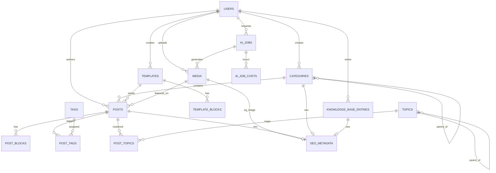

# Database Design: Wide Web Blog

## Document Purpose

This document defines the MySQL database design for Wide Web Blog. It covers the current publishing modules required for the MVP and the future-facing tables needed to support AI-assisted workflows, topic discovery, and cost tracking without major schema rewrites.

## Design Goals

- support a single-admin MVP cleanly
- preserve a path to multi-author expansion
- keep publishing and SEO data normalized enough for long-term maintainability
- support block-based content and reusable templates
- keep media binaries out of MySQL while preserving rich metadata
- isolate AI workflows into task-oriented tables rather than mixing them into editorial state
- use indexes and constraints that support public read patterns, admin management, and future asynchronous processing

## MySQL Conventions

- Engine: `InnoDB`
- Charset: `utf8mb4`
- Collation: `utf8mb4_unicode_ci` or a project-standard utf8mb4 collation
- Primary keys: `BIGINT UNSIGNED AUTO_INCREMENT`
- External-safe identifiers: `CHAR(26)` ULID where helpful for public and async references
- Timestamps: `created_at`, `updated_at` on all main tables
- Soft deletes: use `deleted_at` on editorial tables where recovery is valuable
- JSON columns: use `JSON` only for semi-structured data that is not the main query surface

## Core Design Decisions

- `posts` is the source of truth for article lifecycle and editorial ownership.
- `post_blocks` is the source of truth for article body structure.
- `templates` and `template_blocks` mirror the post content structure for reusable scaffolds.
- `seo_metadata` is modeled as a polymorphic table so SEO data can be shared across posts, categories, and future entities.
- `media` stores metadata only; objects live in Cloudflare R2.
- `tags` and `post_tags` provide flexible many-to-many tagging without overloading categories.
- future AI execution state is stored in `ai_jobs` and `ai_job_costs`, not mixed into post records.

## ERD Diagram

## Relationship Explanation

- One `user` can author many `posts`, upload many `media` items, and create many content objects.
- One `category` can contain many `posts`. A category may optionally have a parent category for future hierarchy support.
- One `post` can have many `post_blocks`, many `tags` through `post_tags`, one featured `media` item, and one SEO metadata record.
- One `template` can have many `template_blocks` and can optionally seed many `posts`.
- One `knowledge_base_entry` can optionally have one SEO metadata record if public or semi-public knowledge content is introduced later.
- One `topic` can map to many `posts` through `post_topics`, supporting future discovery and clustering.
- One `ai_job` can target a post, topic, SEO asset, or media workflow through polymorphic target fields, and can generate multiple cost rows in `ai_job_costs`.
- One `seo_metadata` row belongs to exactly one `seoable` entity through a polymorphic one-to-one relationship.

## Table Designs

## 1. `users`

### Purpose

Store admin and future editorial users.

### Columns

| Column | Data Type | Notes |
|---|---|---|
| `id` | `BIGINT UNSIGNED` | Primary key |
| `ulid` | `CHAR(26)` | Unique stable identifier |
| `name` | `VARCHAR(150)` | Display name |
| `email` | `VARCHAR(190)` | Login email |
| `password_hash` | `VARCHAR(255)` | Hashed password |
| `role` | `ENUM('admin','editor','author')` | MVP uses `admin` |
| `status` | `ENUM('active','inactive')` | Access control |
| `last_login_at` | `TIMESTAMP NULL` | Operational tracking |
| `remember_token` | `VARCHAR(100) NULL` | Laravel auth support |
| `created_at` | `TIMESTAMP` | Standard |
| `updated_at` | `TIMESTAMP` | Standard |

### Relationships

- one-to-many with `posts`
- one-to-many with `categories`
- one-to-many with `templates`
- one-to-many with `media`
- one-to-many with `knowledge_base_entries`
- one-to-many with `ai_jobs`

### Indexes

- primary key on `id`
- unique index on `ulid`
- unique index on `email`
- index on `(role, status)`

### Constraints

- `email` must be unique
- `role` constrained to supported editorial roles
- `status` constrained to active lifecycle values

## 2. `categories`

### Purpose

Store the primary content taxonomy used for navigation and topical authority.

### Columns

| Column | Data Type | Notes |
|---|---|---|
| `id` | `BIGINT UNSIGNED` | Primary key |
| `ulid` | `CHAR(26)` | Unique stable identifier |
| `parent_id` | `BIGINT UNSIGNED NULL` | Optional future hierarchy |
| `created_by_user_id` | `BIGINT UNSIGNED` | Creator |
| `updated_by_user_id` | `BIGINT UNSIGNED NULL` | Last editor |
| `name` | `VARCHAR(120)` | Category label |
| `slug` | `VARCHAR(160)` | Public URL key |
| `description` | `TEXT NULL` | Editorial/category description |
| `is_active` | `TINYINT(1)` | Public/admin availability |
| `sort_order` | `INT UNSIGNED` | Optional admin ordering |
| `created_at` | `TIMESTAMP` | Standard |
| `updated_at` | `TIMESTAMP` | Standard |
| `deleted_at` | `TIMESTAMP NULL` | Soft delete |

### Relationships

- many-to-one with `users` via creator/updater
- self-referencing parent-child relationship
- one-to-many with `posts`
- one-to-one polymorphic with `seo_metadata`

### Indexes

- primary key on `id`
- unique index on `ulid`
- unique index on `slug`
- index on `parent_id`
- index on `(is_active, sort_order)`

### Constraints

- `slug` must be unique
- `parent_id` references `categories.id`
- `created_by_user_id` references `users.id`

## 3. `tags`

### Purpose

Store secondary post taxonomy for many-to-many classification.

### Columns

| Column | Data Type | Notes |
|---|---|---|
| `id` | `BIGINT UNSIGNED` | Primary key |
| `ulid` | `CHAR(26)` | Unique stable identifier |
| `name` | `VARCHAR(100)` | Tag name |
| `slug` | `VARCHAR(140)` | Normalized identifier |
| `description` | `TEXT NULL` | Optional editorial note |
| `is_active` | `TINYINT(1)` | Admin/public eligibility |
| `created_at` | `TIMESTAMP` | Standard |
| `updated_at` | `TIMESTAMP` | Standard |

### Relationships

- many-to-many with `posts` through `post_tags`

### Indexes

- primary key on `id`
- unique index on `ulid`
- unique index on `slug`
- index on `is_active`

### Constraints

- `slug` must be unique

## 4. `posts`

### Purpose

Store the article-level record, lifecycle state, ownership, routing, and high-level content metadata.

### Columns

| Column | Data Type | Notes |
|---|---|---|
| `id` | `BIGINT UNSIGNED` | Primary key |
| `ulid` | `CHAR(26)` | Unique stable identifier |
| `author_user_id` | `BIGINT UNSIGNED` | Current author/owner |
| `category_id` | `BIGINT UNSIGNED` | Primary category |
| `template_id` | `BIGINT UNSIGNED NULL` | Origin template |
| `featured_media_id` | `BIGINT UNSIGNED NULL` | Featured image |
| `title` | `VARCHAR(255)` | Public title |
| `slug` | `VARCHAR(190)` | Public route key |
| `excerpt` | `TEXT NULL` | Summary/teaser |
| `status` | `ENUM('draft','scheduled','published','unpublished','archived')` | Editorial lifecycle |
| `visibility` | `ENUM('public','private','internal')` | Future-safe visibility |
| `published_at` | `TIMESTAMP NULL` | Public go-live time |
| `scheduled_for` | `TIMESTAMP NULL` | Future scheduling |
| `content_version` | `INT UNSIGNED` | Increment on structural edits |
| `reading_time_minutes` | `SMALLINT UNSIGNED NULL` | Cached derived metric |
| `word_count` | `INT UNSIGNED NULL` | Cached derived metric |
| `is_featured` | `TINYINT(1)` | Homepage/highlight support |
| `meta` | `JSON NULL` | Lightweight structured flags |
| `created_at` | `TIMESTAMP` | Standard |
| `updated_at` | `TIMESTAMP` | Standard |
| `deleted_at` | `TIMESTAMP NULL` | Soft delete |

### Relationships

- many-to-one with `users`
- many-to-one with `categories`
- many-to-one with `templates`
- many-to-one with `media` for featured image
- one-to-many with `post_blocks`
- many-to-many with `tags` through `post_tags`
- many-to-many with `topics` through `post_topics`
- one-to-one polymorphic with `seo_metadata`
- one-to-many target for future `ai_jobs`

### Indexes

- primary key on `id`
- unique index on `ulid`
- unique index on `slug`
- index on `author_user_id`
- index on `category_id`
- index on `template_id`
- index on `featured_media_id`
- composite index on `(status, published_at DESC)`
- composite index on `(category_id, status, published_at DESC)`
- composite index on `(is_featured, status, published_at DESC)`

### Constraints

- `author_user_id` references `users.id`
- `category_id` references `categories.id`
- `template_id` references `templates.id`
- `featured_media_id` references `media.id`
- `scheduled_for` should be non-null only when `status = 'scheduled'`
- `published_at` should be non-null when `status = 'published'`

## 5. `post_blocks`

### Purpose

Store ordered structured blocks for post body content.

### Columns

| Column | Data Type | Notes |
|---|---|---|
| `id` | `BIGINT UNSIGNED` | Primary key |
| `post_id` | `BIGINT UNSIGNED` | Parent post |
| `block_key` | `CHAR(26)` | Stable block identifier |
| `block_type` | `VARCHAR(50)` | Example: `heading`, `markdown`, `image`, `code` |
| `sort_order` | `INT UNSIGNED` | Block sequence |
| `content_markdown` | `LONGTEXT NULL` | Text-heavy block source |
| `content_html_cache` | `LONGTEXT NULL` | Optional pre-render cache |
| `plain_text_cache` | `LONGTEXT NULL` | Search or word-count helper |
| `settings` | `JSON NULL` | Block-specific configuration |
| `source_template_block_id` | `BIGINT UNSIGNED NULL` | Traceability to template |
| `created_at` | `TIMESTAMP` | Standard |
| `updated_at` | `TIMESTAMP` | Standard |

### Relationships

- many-to-one with `posts`
- optional many-to-one with `template_blocks`

### Indexes

- primary key on `id`
- unique index on `block_key`
- unique composite index on `(post_id, sort_order)`
- index on `(post_id, block_type)`
- index on `source_template_block_id`

### Constraints

- `post_id` references `posts.id`
- `source_template_block_id` references `template_blocks.id`
- `sort_order` must be unique per post

## 6. `templates`

### Purpose

Store reusable editorial templates for common article structures.

### Columns

| Column | Data Type | Notes |
|---|---|---|
| `id` | `BIGINT UNSIGNED` | Primary key |
| `ulid` | `CHAR(26)` | Unique stable identifier |
| `created_by_user_id` | `BIGINT UNSIGNED` | Creator |
| `updated_by_user_id` | `BIGINT UNSIGNED NULL` | Last editor |
| `name` | `VARCHAR(160)` | Template name |
| `slug` | `VARCHAR(180)` | Stable identifier |
| `template_type` | `VARCHAR(60)` | Example: `tutorial`, `comparison`, `guide` |
| `description` | `TEXT NULL` | Internal explanation |
| `status` | `ENUM('draft','active','archived')` | Lifecycle |
| `default_excerpt_prompt` | `TEXT NULL` | Editorial guidance |
| `default_meta` | `JSON NULL` | Defaults for future use |
| `created_at` | `TIMESTAMP` | Standard |
| `updated_at` | `TIMESTAMP` | Standard |
| `deleted_at` | `TIMESTAMP NULL` | Soft delete |

### Relationships

- many-to-one with `users`
- one-to-many with `template_blocks`
- one-to-many with `posts`

### Indexes

- primary key on `id`
- unique index on `ulid`
- unique index on `slug`
- index on `(template_type, status)`

### Constraints

- `created_by_user_id` references `users.id`
- `updated_by_user_id` references `users.id`
- `slug` must be unique

## 7. `template_blocks`

### Purpose

Store ordered structured blocks that define template scaffolds.

### Columns

| Column | Data Type | Notes |
|---|---|---|
| `id` | `BIGINT UNSIGNED` | Primary key |
| `template_id` | `BIGINT UNSIGNED` | Parent template |
| `block_key` | `CHAR(26)` | Stable block identifier |
| `block_type` | `VARCHAR(50)` | Same block taxonomy as posts |
| `sort_order` | `INT UNSIGNED` | Block order |
| `label` | `VARCHAR(160) NULL` | Internal editor label |
| `default_markdown` | `LONGTEXT NULL` | Seed content |
| `settings` | `JSON NULL` | Block configuration |
| `is_required` | `TINYINT(1)` | Editorial constraint |
| `created_at` | `TIMESTAMP` | Standard |
| `updated_at` | `TIMESTAMP` | Standard |

### Relationships

- many-to-one with `templates`
- one-to-many with `post_blocks` through `source_template_block_id`

### Indexes

- primary key on `id`
- unique index on `block_key`
- unique composite index on `(template_id, sort_order)`
- index on `(template_id, block_type)`

### Constraints

- `template_id` references `templates.id`
- `sort_order` must be unique per template

## 8. `media`

### Purpose

Store metadata for uploaded and future AI-generated media assets.

### Columns

| Column | Data Type | Notes |
|---|---|---|
| `id` | `BIGINT UNSIGNED` | Primary key |
| `ulid` | `CHAR(26)` | Unique stable identifier |
| `uploaded_by_user_id` | `BIGINT UNSIGNED NULL` | Uploader |
| `generated_by_ai_job_id` | `BIGINT UNSIGNED NULL` | Future AI linkage |
| `storage_provider` | `ENUM('r2')` | MVP provider |
| `bucket_name` | `VARCHAR(120)` | R2 bucket |
| `object_key` | `VARCHAR(512)` | Object path/key |
| `original_filename` | `VARCHAR(255)` | Uploaded name |
| `mime_type` | `VARCHAR(120)` | MIME |
| `extension` | `VARCHAR(20) NULL` | File extension |
| `file_size_bytes` | `BIGINT UNSIGNED` | File size |
| `checksum_sha256` | `CHAR(64) NULL` | Deduplication support |
| `width` | `INT UNSIGNED NULL` | Images only |
| `height` | `INT UNSIGNED NULL` | Images only |
| `alt_text` | `VARCHAR(255) NULL` | Accessibility + SEO |
| `caption` | `TEXT NULL` | Optional editorial caption |
| `status` | `ENUM('pending','ready','failed','archived')` | Processing lifecycle |
| `metadata` | `JSON NULL` | Provider or extraction metadata |
| `created_at` | `TIMESTAMP` | Standard |
| `updated_at` | `TIMESTAMP` | Standard |
| `deleted_at` | `TIMESTAMP NULL` | Soft delete |

### Relationships

- many-to-one with `users`
- optional many-to-one with `ai_jobs`
- one-to-many with `posts` via `featured_media_id`
- optional one-to-many with `seo_metadata` via `og_image_media_id`

### Indexes

- primary key on `id`
- unique index on `ulid`
- unique index on `(storage_provider, bucket_name, object_key)`
- index on `uploaded_by_user_id`
- index on `generated_by_ai_job_id`
- index on `(status, created_at DESC)`
- index on `checksum_sha256`

### Constraints

- `uploaded_by_user_id` references `users.id`
- `generated_by_ai_job_id` references `ai_jobs.id`
- object location must be unique per provider and bucket

## 9. `knowledge_base_entries`

### Purpose

Store internal editorial and subject-matter reference material.

### Columns

| Column | Data Type | Notes |
|---|---|---|
| `id` | `BIGINT UNSIGNED` | Primary key |
| `ulid` | `CHAR(26)` | Unique stable identifier |
| `created_by_user_id` | `BIGINT UNSIGNED` | Author |
| `updated_by_user_id` | `BIGINT UNSIGNED NULL` | Last editor |
| `title` | `VARCHAR(255)` | Entry title |
| `slug` | `VARCHAR(190)` | Stable internal slug |
| `entry_type` | `ENUM('guideline','reference','glossary','research','brief')` | Content class |
| `status` | `ENUM('draft','active','archived')` | Lifecycle |
| `summary` | `TEXT NULL` | Short overview |
| `content_markdown` | `LONGTEXT` | Main body |
| `source_url` | `VARCHAR(500) NULL` | Optional external reference |
| `featured_media_id` | `BIGINT UNSIGNED NULL` | Optional supporting image |
| `metadata` | `JSON NULL` | Structured internal fields |
| `created_at` | `TIMESTAMP` | Standard |
| `updated_at` | `TIMESTAMP` | Standard |
| `deleted_at` | `TIMESTAMP NULL` | Soft delete |

### Relationships

- many-to-one with `users`
- optional many-to-one with `media`
- one-to-one polymorphic with `seo_metadata`
- future target for `ai_jobs`

### Indexes

- primary key on `id`
- unique index on `ulid`
- unique index on `slug`
- index on `(entry_type, status)`
- index on `featured_media_id`

### Constraints

- `created_by_user_id` references `users.id`
- `updated_by_user_id` references `users.id`
- `featured_media_id` references `media.id`

## 10. `seo_metadata`

### Purpose

Store reusable SEO data for posts, categories, and future content types.

### Columns

| Column | Data Type | Notes |
|---|---|---|
| `id` | `BIGINT UNSIGNED` | Primary key |
| `seoable_type` | `VARCHAR(120)` | Polymorphic owner type |
| `seoable_id` | `BIGINT UNSIGNED` | Polymorphic owner ID |
| `meta_title` | `VARCHAR(255) NULL` | Search title |
| `meta_description` | `VARCHAR(320) NULL` | Search description |
| `canonical_url` | `VARCHAR(500) NULL` | Canonical override |
| `robots_index` | `TINYINT(1)` | Index/noindex flag |
| `robots_follow` | `TINYINT(1)` | Follow/nofollow flag |
| `og_title` | `VARCHAR(255) NULL` | Social title |
| `og_description` | `VARCHAR(320) NULL` | Social description |
| `og_image_media_id` | `BIGINT UNSIGNED NULL` | Social image |
| `schema_type` | `VARCHAR(120) NULL` | Example: `Article`, `CollectionPage` |
| `schema_payload` | `JSON NULL` | Structured data payload |
| `focus_keyword` | `VARCHAR(190) NULL` | Future editorial helper |
| `created_at` | `TIMESTAMP` | Standard |
| `updated_at` | `TIMESTAMP` | Standard |

### Relationships

- polymorphic one-to-one with `posts`, `categories`, `knowledge_base_entries`, and future entities
- optional many-to-one with `media` for Open Graph image

### Indexes

- primary key on `id`
- unique composite index on `(seoable_type, seoable_id)`
- index on `og_image_media_id`
- index on `focus_keyword`

### Constraints

- one SEO row per `seoable` entity
- `og_image_media_id` references `media.id`
- `robots_index` and `robots_follow` constrained to boolean values

## 11. `post_tags`

### Purpose

Resolve the many-to-many relationship between posts and tags.

### Columns

| Column | Data Type | Notes |
|---|---|---|
| `post_id` | `BIGINT UNSIGNED` | Parent post |
| `tag_id` | `BIGINT UNSIGNED` | Tag |
| `created_at` | `TIMESTAMP` | Auditability |

### Relationships

- many-to-one with `posts`
- many-to-one with `tags`

### Indexes

- composite primary key on `(post_id, tag_id)`
- index on `(tag_id, post_id)`

### Constraints

- `post_id` references `posts.id`
- `tag_id` references `tags.id`
- no duplicate tag assignment per post

## Future Expansion Tables

## 12. `topics`

### Purpose

Store higher-order topic clusters for discovery, planning, and AI-assisted content strategy.

### Columns

| Column | Data Type | Notes |
|---|---|---|
| `id` | `BIGINT UNSIGNED` | Primary key |
| `ulid` | `CHAR(26)` | Unique stable identifier |
| `parent_topic_id` | `BIGINT UNSIGNED NULL` | Optional hierarchy |
| `name` | `VARCHAR(180)` | Topic label |
| `slug` | `VARCHAR(190)` | Stable identifier |
| `description` | `TEXT NULL` | Topic meaning |
| `status` | `ENUM('candidate','active','archived')` | Lifecycle |
| `source_type` | `ENUM('manual','agent','imported')` | Origin |
| `discovery_score` | `DECIMAL(8,4) NULL` | Optional ranking signal |
| `metadata` | `JSON NULL` | Topic signals or notes |
| `created_at` | `TIMESTAMP` | Standard |
| `updated_at` | `TIMESTAMP` | Standard |

### Relationships

- self-referencing hierarchy
- many-to-many with `posts` through `post_topics`
- future target for `ai_jobs`

### Indexes

- primary key on `id`
- unique index on `ulid`
- unique index on `slug`
- index on `parent_topic_id`
- index on `(status, discovery_score DESC)`
- index on `(source_type, created_at DESC)`

### Constraints

- `parent_topic_id` references `topics.id`
- `slug` must be unique

## 13. `post_topics`

### Purpose

Resolve the many-to-many relationship between posts and topics for future clustering, recommendations, and discovery workflows.

### Columns

| Column | Data Type | Notes |
|---|---|---|
| `post_id` | `BIGINT UNSIGNED` | Parent post |
| `topic_id` | `BIGINT UNSIGNED` | Topic |
| `relevance_score` | `DECIMAL(8,4) NULL` | Future AI/manual confidence |
| `assigned_by` | `ENUM('manual','agent')` | Source of assignment |
| `created_at` | `TIMESTAMP` | Auditability |

### Relationships

- many-to-one with `posts`
- many-to-one with `topics`

### Indexes

- composite primary key on `(post_id, topic_id)`
- index on `(topic_id, relevance_score DESC)`
- index on `assigned_by`

### Constraints

- `post_id` references `posts.id`
- `topic_id` references `topics.id`
- no duplicate topic assignment per post

## 14. `ai_jobs`

### Purpose

Track asynchronous AI tasks for discovery, generation, SEO analysis, and media generation.

### Columns

| Column | Data Type | Notes |
|---|---|---|
| `id` | `BIGINT UNSIGNED` | Primary key |
| `ulid` | `CHAR(26)` | Unique external-safe identifier |
| `requested_by_user_id` | `BIGINT UNSIGNED NULL` | User who initiated the task |
| `job_type` | `ENUM('topic_discovery','content_generation','image_generation','seo_analysis','seo_generation','content_revision')` | Workflow type |
| `target_type` | `VARCHAR(120) NULL` | Polymorphic owner |
| `target_id` | `BIGINT UNSIGNED NULL` | Polymorphic owner ID |
| `provider` | `VARCHAR(60) NULL` | OpenAI, Anthropic, Gemini, etc. |
| `model` | `VARCHAR(120) NULL` | Provider model name |
| `queue_name` | `VARCHAR(50)` | Intended queue |
| `status` | `ENUM('pending','queued','processing','completed','failed','cancelled','reviewed')` | Task state |
| `priority` | `SMALLINT UNSIGNED` | Scheduling hint |
| `attempt_count` | `SMALLINT UNSIGNED` | Retry tracking |
| `input_payload` | `JSON NULL` | Prompt/context snapshot |
| `output_payload` | `JSON NULL` | Normalized result |
| `error_message` | `TEXT NULL` | Failure reason |
| `started_at` | `TIMESTAMP NULL` | Runtime start |
| `completed_at` | `TIMESTAMP NULL` | Runtime end |
| `created_at` | `TIMESTAMP` | Standard |
| `updated_at` | `TIMESTAMP` | Standard |

### Relationships

- many-to-one with `users`
- one-to-many with `ai_job_costs`
- optional one-to-many with `media`
- polymorphic optional target to `posts`, `topics`, `knowledge_base_entries`, or future entities

### Indexes

- primary key on `id`
- unique index on `ulid`
- index on `requested_by_user_id`
- composite index on `(job_type, status, created_at DESC)`
- composite index on `(target_type, target_id, created_at DESC)`
- composite index on `(queue_name, status, priority DESC, created_at ASC)`
- index on `(provider, model)`

### Constraints

- `requested_by_user_id` references `users.id`
- `attempt_count` must be non-negative
- `completed_at` should be non-null only for terminal states

## 15. `ai_job_costs`

### Purpose

Track granular cost and usage metrics for AI jobs, including multi-call workflows.

### Columns

| Column | Data Type | Notes |
|---|---|---|
| `id` | `BIGINT UNSIGNED` | Primary key |
| `ai_job_id` | `BIGINT UNSIGNED` | Parent AI job |
| `provider` | `VARCHAR(60)` | Provider name |
| `model` | `VARCHAR(120) NULL` | Model name |
| `call_type` | `ENUM('text','image','embedding','moderation','other')` | Billing class |
| `input_tokens` | `INT UNSIGNED NULL` | Token usage |
| `output_tokens` | `INT UNSIGNED NULL` | Token usage |
| `cached_input_tokens` | `INT UNSIGNED NULL` | Provider-specific optimization |
| `image_count` | `INT UNSIGNED NULL` | For image generation |
| `estimated_cost_usd` | `DECIMAL(12,6) NULL` | Estimated or calculated cost |
| `billed_cost_usd` | `DECIMAL(12,6) NULL` | Actual billed amount if known |
| `currency` | `CHAR(3)` | Usually `USD` |
| `usage_metadata` | `JSON NULL` | Raw usage detail |
| `created_at` | `TIMESTAMP` | Standard |

### Relationships

- many-to-one with `ai_jobs`

### Indexes

- primary key on `id`
- index on `ai_job_id`
- composite index on `(provider, model, created_at DESC)`
- composite index on `(call_type, created_at DESC)`

### Constraints

- `ai_job_id` references `ai_jobs.id`
- `estimated_cost_usd` and `billed_cost_usd` must be non-negative
- `currency` should be ISO-4217 compatible

## Relationship Strategy By Module

### Users

- `users` is the root editorial actor table.
- avoid hardcoding single-admin assumptions into schema design.
- `role` and `status` are enough for MVP and near-term growth.

### Categories And Tags

- categories are primary taxonomy and should remain simpler than tags.
- tags are optional and many-to-many, better suited for cross-cutting classification.
- future topic discovery should use `topics`, not overload `tags`.

### Posts And Post Blocks

- keep post-level data in `posts`
- keep ordered body structure in `post_blocks`
- derive rendered output, word count, and reading time from block content
- this prevents the `posts` table from becoming an unstructured content blob

### Templates

- `templates` and `template_blocks` intentionally mirror `posts` and `post_blocks`
- this supports reliable draft creation from template scaffolds
- future AI generation can consume template structure directly

### Media

- media metadata belongs in MySQL
- binary assets belong in R2
- object paths must be unique and immutable enough for retrieval integrity

### SEO Metadata

- polymorphic SEO metadata avoids duplicated SEO columns across content tables
- one-to-one ownership keeps lookup logic simple
- the model is future-safe for new content types

### AI Jobs And Cost Tracking

- `ai_jobs` stores task lifecycle, provider metadata, and normalized inputs/outputs
- `ai_job_costs` stores per-call usage and cost
- separating cost rows from jobs supports multi-step chains and future provider reconciliation

## Scalability Considerations

### 1. Public Read Performance

- index `posts` for `status + published_at` because published listing queries will dominate traffic
- keep `slug` unique and indexed for route resolution
- precompute `word_count` and `reading_time_minutes` to avoid recomputation on each request

### 2. Block-Based Content Growth

- `post_blocks` can grow quickly for long-form content
- the unique `(post_id, sort_order)` index keeps rendering deterministic
- avoid querying JSON block settings for primary public queries

### 3. Taxonomy Growth

- use `categories` for primary navigation
- let `tags` and future `topics` absorb richer classification use cases
- this prevents category sprawl and preserves clean public IA

### 4. Media Scale

- R2 keeps object storage outside MySQL
- `checksum_sha256` helps deduplication later
- do not store generated derivatives as separate schema concepts until the need is real; use `metadata` first

### 5. Async AI Expansion

- `ai_jobs` is designed for queue-friendly status transitions
- target polymorphism allows one job table to serve posts, topics, media, and SEO workflows
- `queue_name + status + priority` indexing supports worker scheduling and ops tooling

### 6. Future Multi-Site Expansion

If multi-site support is introduced later, add a `site_id` to core content tables:

- `categories`
- `posts`
- `templates`
- `knowledge_base_entries`
- `topics`
- potentially `tags`

Do not add `site_id` in the MVP unless multi-site is imminent, because it increases complexity across every query path.

## Future AI Expansion Support

The schema is intentionally designed so future agents fit without rewriting core publishing tables.

### Topic Discovery Agent

- writes candidate records into `topics`
- links discovered topics to posts using `post_topics`
- stores run history in `ai_jobs`

### Content Generation Agent

- targets a `post` or a future content brief
- writes run metadata to `ai_jobs`
- saves resulting draft content into `posts` and `post_blocks`, never directly to published state

### Image Generation Agent

- creates an `ai_job`
- writes generated asset metadata into `media`
- links generated media back through `generated_by_ai_job_id`

### SEO Agent

- evaluates a `post`, `category`, or other SEO-capable entity
- stores task history in `ai_jobs`
- proposes updates to `seo_metadata` through review workflows rather than direct overwrite

## Recommended Migration Order

1. `users`
2. `categories`
3. `tags`
4. `templates`
5. `template_blocks`
6. `media`
7. `posts`
8. `post_blocks`
9. `knowledge_base_entries`
10. `seo_metadata`
11. `post_tags`
12. `topics`
13. `post_topics`
14. `ai_jobs`
15. `ai_job_costs`

In actual migrations, reorder slightly if foreign key cycles require nullable references or follow-up alter statements. The most likely case is `posts.featured_media_id` and `media.generated_by_ai_job_id`, which may need phased foreign key creation.

## Summary

This schema gives Wide Web Blog a clean MySQL foundation for technical publishing, SEO, media, templates, and internal knowledge management while preserving explicit growth paths for topics, AI job orchestration, and cost tracking. The design keeps editorial truth centered in `posts` and related content tables while isolating future AI automation into task-oriented structures that can grow without destabilizing the core publishing model.
